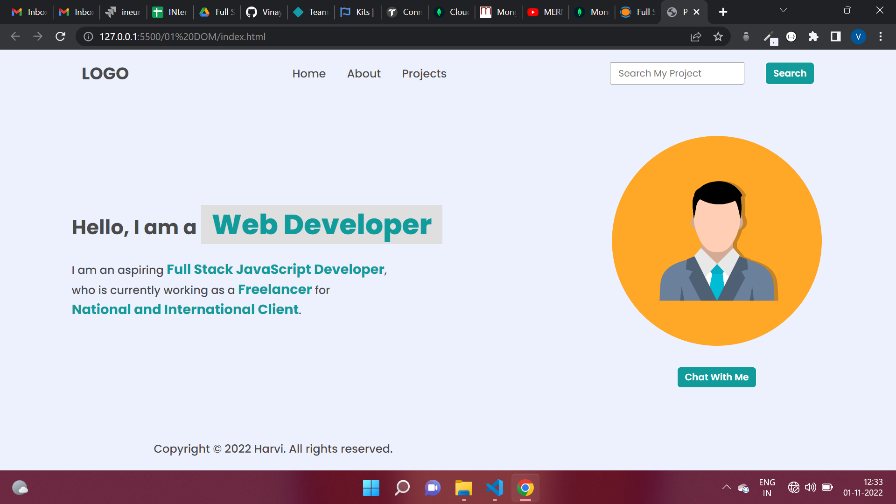

# Dom Assignment 1,2,3

###  Assignment 1 :
1. 

#### code : 
        document.querySelector("ul li:nth-child(3)").textContent="Projects";
   
        //for inserting Hire me in list
        let element=document.createElement("li");
        element.textContent="Hire me";
        document.querySelector("ul").appendChild(element);

-----
2. 

#### code :
        //changed placeholder
       document.querySelector("#text").placeholder="Search My Project";
      
      //removed icon
       const parent=document.querySelector("footer");
     parent.removeChild(parent.children[1]);

----
3.

#### code:
        //change paragraph span
       document.querySelector(".hero-left-section p span:nth-child(3)").textContent="an Employee";
       document.querySelector(".hero-left-section p span:nth-child(5)").textContent="iNeuron intelligennce pvt Ltd.";
       ----
4. 
   
#### code :
//chnaged avtar into picture
      document.querySelector(".hero-right-section img").src="img.jpg"; 
----
5. 

#### code:
    //adding support me button
      let btn=document.createElement("button");
      btn.textContent="Support me";

      const result=document.querySelector(".hero-right-section-btns").appendChild(btn);
      result.style.flex=""    
      
      
----

### Assignment 2 :

1. 

#### Code :

----
2. 

#### Code :

----

### Assignment 3 :

#### Code :
      document.querySelector(".enterName").placeholder="FSJS 2.0";
      document.querySelector(".enterMail").placeholder="fsjs@ineuron.ai";
      document.querySelector(".enterMessage").placeholder="Hello World";

      document.querySelector(".userName").placeholder="FSJS 2.0";
      document.querySelector(".userEmail").placeholder="fsjs@ineuron.ai";
      document.querySelector(".userMessage").placeholder="Hello World";

